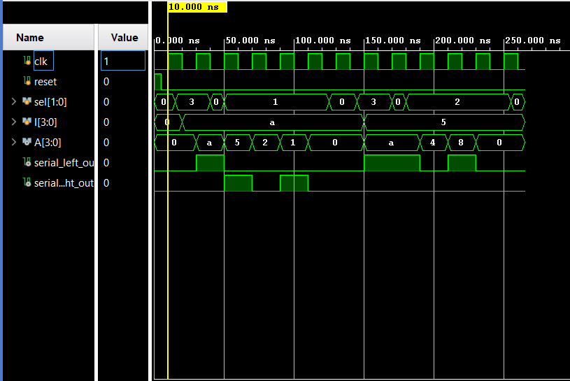

# Universal Shift Register in Verilog

## Project Overview

This project implements a 4-bit Universal Shift Register using Verilog HDL. The design supports four operating modes: Hold, Shift Right, Shift Left, and Parallel Load. The register is constructed hierarchically using D Flip-Flops and 4-to-1 Multiplexers, demonstrating a modular digital design approach.

The design was functionally verified through simulation and synthesized using Xilinx Vivado 2025.2 targeting the XC7Z010CLG400-1 FPGA.

---

## Features

* 4-bit Universal Shift Register
* Hold Operation
* Shift Right Operation
* Shift Left Operation
* Parallel Load Operation
* Serial Left Output
* Serial Right Output
* Asynchronous Active-High Reset
* Hierarchical RTL Design

---

## Design Architecture

The Universal Shift Register is built using:

* Four D Flip-Flops
* Four 4-to-1 Multiplexers

Each multiplexer selects the next-state input for its corresponding flip-flop based on the selected operating mode.

---

## Module Interface

### Inputs

| Signal       | Width | Description                    |
| ------------ | ----- | ------------------------------ |
| clk          | 1     | System clock                   |
| reset        | 1     | Asynchronous active-high reset |
| sel          | 2     | Mode selection                 |
| serial_left  | 1     | Serial input for left shift    |
| serial_right | 1     | Serial input for right shift   |
| I            | 4     | Parallel data input            |

### Outputs

| Signal           | Width | Description         |
| ---------------- | ----- | ------------------- |
| A                | 4     | Register contents   |
| serial_left_out  | 1     | Left serial output  |
| serial_right_out | 1     | Right serial output |

---

## Operating Modes

| sel[1:0] | Operation     |
| -------- | ------------- |
| 00       | Hold          |
| 01       | Shift Right   |
| 10       | Shift Left    |
| 11       | Parallel Load |

### Hold (00)

The register retains its current value.

### Shift Right (01)

Data shifts toward the least significant bit (LSB). New serial data enters from the right-shift serial input.

### Shift Left (10)

Data shifts toward the most significant bit (MSB). New serial data enters from the left-shift serial input.

### Parallel Load (11)

All four bits are loaded simultaneously from the parallel input bus.

---

## Simulation Results

The design was verified using a dedicated Verilog testbench.

### Verified Operations

* Reset Operation
* Parallel Load
* Hold Mode
* Shift Right Mode
* Shift Left Mode
* Serial Output Generation

### Simulation Waveform

### Waveform Description

The simulation waveform demonstrates:

1. Parallel loading of the value **A (1010₂)** into the register.
2. Hold mode, where the register maintains its contents.
3. Shift-right operation, producing the sequence:

   * 1010 → 0101 → 0010 → 0001 → 0000
4. Parallel loading of the value **5 (0101₂)**.
5. Shift-left operation, producing the sequence:

   * 0101 → 1010 → 0100 → 1000 → 0000
6. Correct generation of both serial output signals during shifting operations.

---

## Synthesis Results

### Target Device

* FPGA: XC7Z010CLG400-1
* Tool: Vivado 2025.2

### Resource Utilization

| Resource        | Used | Available | Utilization |
| --------------- | ---- | --------- | ----------- |
| Slice LUTs      | 4    | 17,600    | 0.02%       |
| Slice Registers | 4    | 35,200    | 0.01%       |
| DSP Blocks      | 0    | 80        | 0.00%       |
| Block RAM       | 0    | 60        | 0.00%       |
| BUFG            | 1    | 32        | 3.13%       |

### Resource Summary

* 4 LUTs implement the multiplexing logic.
* 4 Flip-Flops store the register state.
* No DSP blocks or memory resources are required.
* The design occupies less than 0.05% of the available FPGA resources.

---

## Applications

* Serial Communication Systems
* Data Storage and Transfer
* Data Conversion
* Processor Datapaths
* Embedded Systems
* Digital System Design Education

---

## Conclusion

This project demonstrates the implementation of a 4-bit Universal Shift Register using a hierarchical design methodology. By combining D Flip-Flops and 4-to-1 Multiplexers, the design supports Hold, Shift Right, Shift Left, and Parallel Load operations while maintaining extremely low FPGA resource utilization.

## Author
  Madhu Visagan H T
